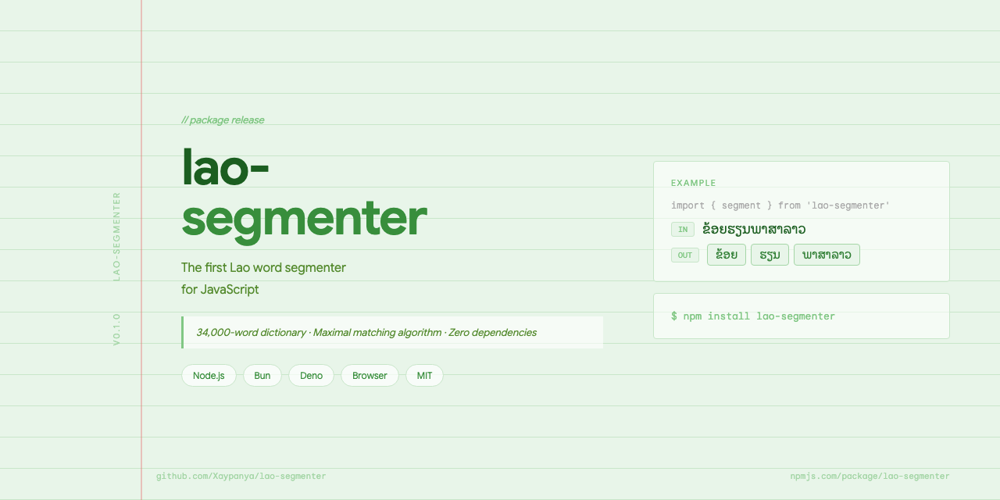

# lao-segmenter



A Lao word segmenter that runs **everywhere JavaScript runs**. It splits unsegmented Lao text into words using a dictionary of **35,000 Lao words** and a maximal matching algorithm — the same technique used by [PyThaiNLP](https://github.com/PyThaiNLP/pythainlp) for Thai text.

```js
import { segment } from 'lao-segmenter'

segment('ຂ້ອຍຮຽນພາສາລາວ')
// → ['ຂ້ອຍ', 'ຮຽນ', 'ພາສາລາວ']
// → ['I',    'study', 'Lao language']
```

Zero dependencies. No Node.js built-ins. The dictionary is compiled into the module, so the same import works in a browser, on a server, and at the edge — no bundler config, no `fs` polyfill, no copying files into `public/`.

---

## Why this package exists

Lao script has no spaces between words — just like Thai or Khmer. This makes it hard for computers to know where one word ends and the next begins. Until now, no Lao word segmenter existed for JavaScript. This package fills that gap.

---

## Install

```bash
npm install lao-segmenter
```

```bash
pnpm add lao-segmenter    # or: yarn add · bun add
```

Requires Node.js 16+ (or any modern browser, Bun, or Deno).

---

## Framework support

Every one of these is verified by a real production build in CI — see [`scripts/verify-package.mjs`](./scripts/verify-package.mjs).

| Environment | Status | Notes |
|---|---|---|
| Node.js (ESM + CJS) | ✅ | `import` and `require` both work |
| Vite | ✅ | React, Vue, Svelte, Solid, Preact, Qwik |
| webpack 5 | ✅ | including Create React App |
| Next.js 15 | ✅ | Server Components, Client Components, and `runtime = 'edge'` |
| Nuxt 3 | ✅ | SSR and client |
| SvelteKit 2 | ✅ | SSR and client |
| Astro 4 | ✅ | build-time frontmatter and client `<script>` |
| Remix / React Router | ✅ | Vite-based, same as Vite above |
| Browsers via `<script src>` | ✅ | UMD-style global, see [CDN](#use-from-a-cdn) |
| Cloudflare Workers, Vercel Edge, Deno Deploy | ✅ | no Node built-ins to polyfill |
| Web Workers | ✅ | good place to put segmentation of long text |
| Bun, Deno | ✅ | |

### Copy-paste examples

<details open>
<summary><b>React / Preact / Solid</b></summary>

```jsx
import { useMemo } from 'react'
import { Segmenter } from 'lao-segmenter'

// Build the dictionary index once, outside the component.
const segmenter = new Segmenter()

export function LaoText({ text }) {
  const words = useMemo(() => segmenter.segment(text, { keepWhitespace: false }), [text])
  return (
    <p>
      {words.map((w, i) => (
        <span key={i} className="lao-word">{w}</span>
      ))}
    </p>
  )
}
```
</details>

<details>
<summary><b>Vue 3 / Nuxt</b></summary>

```vue
<script setup>
import { computed } from 'vue'
import { Segmenter } from 'lao-segmenter'

const segmenter = new Segmenter()
const props = defineProps({ text: String })
const words = computed(() => segmenter.segment(props.text, { keepWhitespace: false }))
</script>

<template>
  <p><span v-for="(w, i) in words" :key="i" class="lao-word">{{ w }}</span></p>
</template>
```

In Nuxt this works in both the server and client halves of a page — no `nitro.externals` or `vite.optimizeDeps` entry needed.
</details>

<details>
<summary><b>Svelte / SvelteKit</b></summary>

```svelte
<script>
  import { Segmenter } from 'lao-segmenter'

  const segmenter = new Segmenter()
  export let text = ''
  $: words = segmenter.segment(text, { keepWhitespace: false })
</script>

<p>{#each words as w}<span class="lao-word">{w}</span>{/each}</p>
```
</details>

<details>
<summary><b>Next.js (App Router)</b></summary>

```jsx
// app/page.jsx — Server Component, segmentation happens on the server
import { segment } from 'lao-segmenter'

export default function Page() {
  const words = segment('ຂ້ອຍຮຽນພາສາລາວ', { keepWhitespace: false })
  return <p>{words.join(' · ')}</p>
}
```

```jsx
// app/search.jsx — Client Component, segmentation happens in the browser
'use client'
import { Segmenter } from 'lao-segmenter'

const segmenter = new Segmenter()
export default function Search({ query }) {
  return <p>{segmenter.segment(query, { keepWhitespace: false }).join(' · ')}</p>
}
```

Edge routes work too:

```js
// app/api/segment/route.js
import { segment } from 'lao-segmenter'
export const runtime = 'edge'

export async function POST(req) {
  const { text } = await req.json()
  return Response.json({ tokens: segment(text, { keepWhitespace: false }) })
}
```
</details>

<details>
<summary><b>Astro</b></summary>

```astro
---
import { segment } from 'lao-segmenter'
const words = segment('ຂ້ອຍຮຽນພາສາລາວ', { keepWhitespace: false })
---
<p>{words.join(' · ')}</p>
```

Segmenting in the frontmatter runs at build time, so the browser downloads no dictionary at all.
</details>

<details>
<summary><b>Web Worker (keeps long text off the main thread)</b></summary>

```js
// worker.js
import { Segmenter } from 'lao-segmenter'
const segmenter = new Segmenter()
self.onmessage = (e) => self.postMessage(segmenter.segment(e.data))
```

```js
// main.js
const worker = new Worker(new URL('./worker.js', import.meta.url), { type: 'module' })
worker.onmessage = (e) => console.log(e.data)
worker.postMessage('ຂ້ອຍຮຽນພາສາລາວ')
```
</details>

### Use from a CDN

```html
<script src="https://unpkg.com/lao-segmenter"></script>
<script>
  console.log(LaoSegmenter.segment('ຂ້ອຍຮຽນພາສາລາວ'))
</script>
```

Or as a module, with no build step at all:

```html
<script type="module">
  import { segment } from 'https://esm.sh/lao-segmenter'
  console.log(segment('ຂ້ອຍຮຽນພາສາລາວ'))
</script>
```

---

## Quick start

```js
import { segment } from 'lao-segmenter'

// Basic segmentation
segment('ສະບາຍດີ')
// → ['ສະບາຍດີ']  (one dictionary word)

segment('ຄົນລາວ')
// → ['ຄົນ', 'ລາວ']  (two words: "person" + "Lao")

segment('ຂ້ອຍໄປຮຽນທີ່ໂຮງຮຽນ')
// → ['ຂ້ອຍ', 'ໄປ', 'ຮຽນ', 'ທີ່', 'ໂຮງຮຽນ']
// → ['I',    'go',  'study', 'at', 'school']
```

Mixed Lao and English:

```js
segment('ພາສາລາວ hello world')
// → ['ພາສາລາວ', ' ', 'hello', ' ', 'world']
```

Numbers and prices:

```js
segment('ລາຄາ 1000 ກີບ')
// → ['ລາຄາ', ' ', '1000', ' ', 'ກີບ']
// → ['price', ' ', '1000', ' ', 'kip']
```

---

## API

### `segment(text, options?)`

Splits a string into an array of tokens.

```ts
segment(text: string, options?: SegmentOptions): string[]
```

**Options:**

| Option | Type | Default | Description |
|---|---|---|---|
| `keepWhitespace` | `boolean` | `true` | Include space tokens in the result |
| `customWords` | `string[]` | `[]` | Extra words to add to the dictionary |
| `trie` | `Trie` | — | Bring your own pre-built Trie |

**Examples:**

```js
// Remove spaces from the output
segment('ຂ້ອຍ ຮຽນ ພາສາ', { keepWhitespace: false })
// → ['ຂ້ອຍ', 'ຮຽນ', 'ພາສາ']

// Add custom words not in the default dictionary
segment('ໂຄ້ດດິ້ງລາວ', { customWords: ['ໂຄ້ດດິ້ງ'] })
// → ['ໂຄ້ດດິ້ງ', 'ລາວ']
```

> Passing `customWords` rebuilds the dictionary index on every call. If you use the same custom words more than once, use the `Segmenter` class instead.

---

### `new Segmenter(options?)`

A reusable class that builds the dictionary index once and reuses it across many calls. Faster when you segment a lot of text, and the right default for UI code.

```js
import { Segmenter } from 'lao-segmenter'

const seg = new Segmenter({ customWords: ['ຊາວໜຸ່ມ'] })

seg.segment('ຊາວໜຸ່ມລາວ')       // → ['ຊາວໜຸ່ມ', 'ລາວ']
seg.segment('ຂ້ອຍຮຽນ')          // → ['ຂ້ອຍ', 'ຮຽນ']
seg.has('ຊາວໜຸ່ມ')              // → true
seg.addWords(['ນັກຂຽນໂປຣແກຣມ']) // extend in place
```

| Option | Type | Description |
|---|---|---|
| `customWords` | `string[]` | Words added on top of the built-in dictionary |
| `words` | `Iterable<string>` | Replace the built-in dictionary entirely |
| `trie` | `Trie` | Use a pre-built Trie |
| `keepWhitespace` | `boolean` | Default for every `.segment()` call on this instance |

---

### `splitLGC(text)`

A lower-level function that splits text into **Lao Grapheme Clusters** — the smallest atomic units of Lao script (roughly one syllable per cluster). Useful when you need character-level control.

```js
import { splitLGC } from 'lao-segmenter'

splitLGC('ເກາະ')
// → ['ເກາະ']  (one cluster: leading vowel + consonant + trailing vowel)
```

---

### Dictionary access

```js
import { getLaoWords, getRawDict, DICTIONARY_SIZE, getDefaultTrie } from 'lao-segmenter'

DICTIONARY_SIZE   // 35185
getLaoWords()     // readonly string[], sorted — decoded lazily and cached
getRawDict()      // the same list as newline-separated text
getDefaultTrie()  // the shared prefix tree behind segment()
```

---

## Bundle size

The dictionary is the bulk of the package. Pick the entry point that matches what you need:

| Import | Minified | Gzipped | Contains |
|---|---|---|---|
| `lao-segmenter` | ~380 KB | ~110 KB | engine + 35k-word dictionary |
| `lao-segmenter/core` | ~3 KB | ~1.5 KB | engine only — you supply the words |
| `lao-segmenter/dictionary` | ~375 KB | ~108 KB | the word list only |

The word list is stored [front-coded](./scripts/generate-dict-module.mjs) (each entry keeps only the part that differs from the previous word), which cuts it roughly in half before gzip even runs.

**If 110 KB is too much for your page**, you have three good options:

1. **Segment on the server** (Next.js Server Component, Astro frontmatter, Nuxt server route). The browser then downloads zero bytes of dictionary.
2. **Load it lazily** so it never blocks first paint:
   ```js
   const { segment } = await import('lao-segmenter')
   ```
3. **Ship your own smaller word list** with the core entry point:
   ```js
   import { Segmenter, parseWordList } from 'lao-segmenter/core'

   const raw = await fetch('/my-lao-words.txt').then((r) => r.text())
   const segmenter = new Segmenter({ words: parseWordList(raw) })
   ```

---

## How it works

1. **Trie lookup** — the 35,000-word dictionary is loaded into a prefix tree (trie) for fast lookups.
2. **Maximal matching** — at each position, the algorithm finds the longest word that matches the dictionary.
3. **LGC fallback** — if no dictionary match is found, the segmenter advances one Lao Grapheme Cluster so it never gets stuck on unknown words.
4. **ໆ absorption** — the Lao repetition mark ໆ is always merged with the word before it (e.g. `ຕ່າງໆ` stays as one token).

This is the same algorithm family as PyThaiNLP's `newmm` tokenizer, adapted for Lao Unicode.

---

## Dictionary sources

The built-in dictionary combines these open-source word lists:

| Source | Words | License |
|---|---|---|
| [Lao Dictionary](https://github.com/wannaphong/LaoNLP) by Brian Wilson | ~11,000 | BSD 3-Clause |
| [Wiktionary Lao](https://github.com/wannaphong/LaoNLP) snapshot 2021 | ~13,000 | CC-BY-SA 3.0 |
| [Google Language Resources](https://github.com/google/language-resources) spell-check | ~21,000 | Apache 2.0 |

After deduplication: **35,185 unique words**.

---

## CommonJS usage

```js
const { segment } = require('lao-segmenter')

segment('ສະບາຍດີ')
// → ['ສະບາຍດີ']
```

---

## TypeScript

This package ships with full TypeScript types for every entry point, and resolves correctly under both `moduleResolution: "bundler"` and `"node16"`.

```ts
import { segment, Segmenter, type SegmentOptions } from 'lao-segmenter'

const options: SegmentOptions = { keepWhitespace: false }
const tokens: string[] = segment('ຂ້ອຍຮຽນ', options)
```

---

## Development

```bash
npm install
npm run build        # regenerates the dictionary module, then bundles
npm test             # 543 unit tests
npm run test:pkg     # packs the tarball and loads it as a real consumer would
npm run typecheck
```

To update the dictionary from the original upstream sources:

```bash
npm run rebuild-dict      # downloads sources → data/lao-words.txt
npm run generate:dict     # data/lao-words.txt → src/generated/dictionary-data.ts
```

---

## Related projects

- [LaoNLP](https://github.com/wannaphong/LaoNLP) — Lao NLP library for Python
- [PyThaiNLP](https://github.com/PyThaiNLP/pythainlp) — Thai NLP library (inspiration for the algorithm)
- [Awesome Lao NLP](https://github.com/wannaphong/Awesome-Lao-NLP) — curated list of Lao language resources

---

## License

MIT © [Xaypanya Phongsa](https://github.com/Xaypanya)

The bundled dictionary files have separate licenses — see [Dictionary sources](#dictionary-sources) above.
